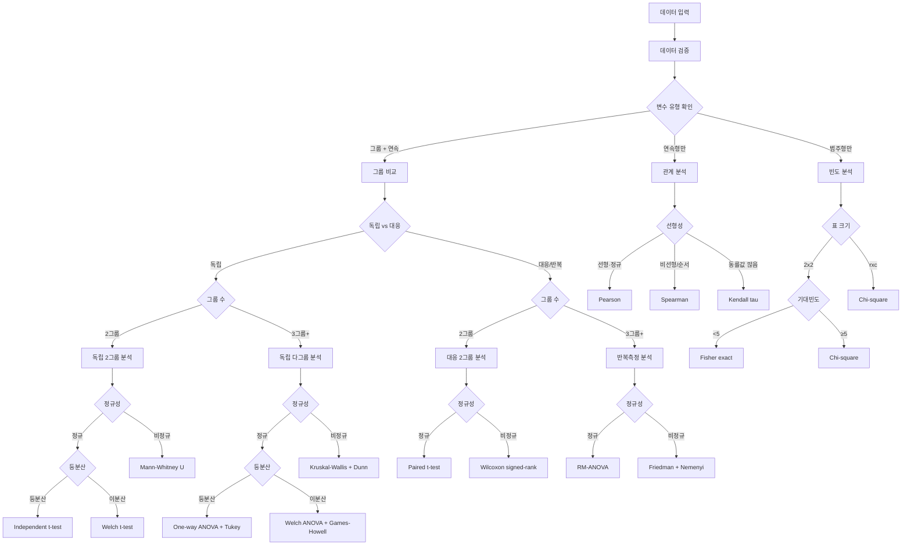

# 통계 분석 의사결정 트리 (Statistical Decision Tree)

## 📊 개선된 분석 흐름도



## 1️⃣ 초기 데이터 분석 단계

### 변수 유형 판단
- **연속형 변수**: 수치 데이터 (생존율, 체중, 길이 등)
- **그룹 변수**: 범주형 데이터 (사육방법, 계절, 지역 등)
- **ID 변수**: 고유 식별자 (개체번호 등)

## 2️⃣ 두 그룹 비교 (Two Group Comparison)

### 먼저 확인할 사항: 독립 vs 대응

| 설계 유형 | 특징 | 예시 |
|----------|------|------|
| **독립 표본** | 서로 다른 개체 | A그룹 vs B그룹 생존율 |
| **대응 표본** | 같은 개체의 반복측정 | 처리 전 vs 처리 후 |

### 2-1. 독립 표본 두 그룹 비교

#### 의사결정 과정

1. **정규성 검정**
   - **권장 방법**: Shapiro-Wilk test (모든 표본크기)
   - **보조 방법**: QQ plot, 왜도(-2~2), 첨도(-7~7)
   - **판단 기준**: p > 0.05 + 시각적 확인

2. **등분산성 검정**
   - **기본**: Levene's test (평균 기반)
   - **권장**: Brown-Forsythe test (중앙값 기반, 이상치 강건)
   - **판단 기준**: p > 0.05 → 등분산

| 정규성 | 등분산성 | 1차 선택 | 대안 방법 | 효과크기 |
|--------|----------|----------|-----------|----------|
| ✅ | ✅ | Independent t-test | Mann-Whitney U | Cohen's d |
| ✅ | ❌ | Welch t-test | Mann-Whitney U | Glass's Δ |
| ❌ | - | Mann-Whitney U | Yuen's t (절사평균) | Cliff's delta |

### 2-2. 대응 표본 두 그룹 비교

| 정규성(차이값) | 1차 선택 | 대안 방법 | 효과크기 |
|---------------|----------|-----------|----------|
| ✅ | Paired t-test | Bootstrap CI | Cohen's d_z |
| ❌ | Wilcoxon signed-rank | Sign test | Matched-pairs rank biserial |

### 결과 해석 후 추가 분석
- **p < 0.05 (유의한 차이)**
  - 효과 크기 계산 (Cohen's d)
  - 신뢰구간 계산
  - 검정력 분석
- **p ≥ 0.05 (유의하지 않음)**
  - 동등성 검정 고려
  - 검정력 분석 (표본 크기 충분한지)
  - 베이지안 분석 고려

## 3️⃣ 세 그룹 이상 비교 (Multiple Group Comparison)

### 3-1. 독립 표본 다그룹 비교

| 정규성 | 등분산성 | 1차 선택 | 사후검정 | 효과크기 | p값 보정 |
|--------|----------|----------|----------|----------|----------|
| ✅ | ✅ | One-way ANOVA | Tukey HSD | η², ω² | - |
| ✅ | ❌ | **Welch ANOVA** | Games-Howell | η²_p² | - |
| ❌ | - | Kruskal-Wallis | Dunn test + Holm(기본) | ε² | BH(FDR 제어 시) |

² **Welch ANOVA 효과크기 주의사항**: 
- 부분 에타 제곱(η²_p) 사용 시 과대추정 가능
- 가능하면 omega squared(ω²) 보고 권장
- 해석은 일반 ANOVA와 동일 기준 적용

### 3-2. 반복측정/대응 표본 다그룹 비교

| 설계 | 정규성 | 1차 선택 | 사후검정 | 구형성 검정 |
|------|--------|----------|----------|---------|
| **반복측정** | ✅ | RM-ANOVA | Paired t + Bonferroni | Mauchly test → 위반 시 보정¹ |
| **반복측정** | ❌ | Friedman | Conover/Nemenyi + Holm | - |
| **혼합설계** | ✅ | Mixed ANOVA | Simple effects | Sphericity 검정 필수 |

¹ **구형성 위반 시 보정 방법**:
- **Greenhouse-Geisser**: 가장 보수적, ε < 0.75일 때
- **Huynh-Feldt**: 덜 보수적, ε > 0.75일 때
- **다변량 접근**: MANOVA (표본 충분 시)

### 사후검정 p값 보정 방법

| 보정 방법 | 특징 | 언제 사용 | 비모수 적용 |
|----------|------|----------|------------|
| **Holm** | Bonferroni 개선, 순차적 | **기본 권장** | Dunn + Holm |
| **Hochberg** | Holm보다 검정력 높음 | 독립 가정 충족 시 | 적용 가능 |
| **Benjamini-Hochberg (BH)** | FDR 제어, 덜 보수적 | 탐색적/다중 변수 | Dunn + BH |
| **Bonferroni** | 가장 보수적 | 비교 수 적을 때 | Nemenyi 내장 |

### 추가 고려사항
- **선형 경향 분석**: 그룹이 순서형일 때
- **대비 분석**: 특정 그룹 조합 비교
- **다중 비교 보정**: FWER vs FDR

## 4️⃣ 이원분산분석 (Two-way ANOVA)

### 적용 조건
- 두 개의 독립변수 (예: 사육방법 × 계절)
- 하나의 종속변수 (예: 생존율)

### 분석 순서
1. **주효과(Main effects)** 검정
2. **상호작용 효과(Interaction effect)** 검정
3. 상호작용 유의시 → **단순 주효과 분석**
4. 상호작용 비유의시 → **각 요인별 사후검정**

### 선택 옵션

#### 상호작용이 유의한 경우 (p < 0.05)
```
옵션 1: 단순 주효과 분석 (Simple Main Effects)
- A 수준별로 B의 효과 검정
- B 수준별로 A의 효과 검정

옵션 2: 단순 단순 주효과 (Simple Simple Main Effects)
- 특정 조합에서만 비교

옵션 3: 상호작용 대비 (Interaction Contrasts)
- 특정 패턴 검정
```

#### 상호작용이 유의하지 않은 경우
```
옵션 1: 주효과별 사후검정
- 요인 A에 대한 다중비교
- 요인 B에 대한 다중비교

옵션 2: 주효과 해석만
- 추가 검정 없이 주효과만 보고
```

## 5️⃣ 범주형 데이터 분석 (Categorical Data Analysis)

### 교차표 분석 의사결정

| 표 크기 | 조건 | 1차 선택 | 대안 | 사후분석 |
|---------|------|----------|------|----------|
| **2×2** | 기대빈도 ≥ 5 | Chi-square | - | OR, RR |
| **2×2** | 기대빈도 < 5 | Fisher's exact | - | OR |
| **r×c** | 기대빈도 ≥ 5 (80%+) | Chi-square | - | 잔차분석 |
| **r×c** | 기대빈도 < 5 (>20%) | Fisher's exact/Monte Carlo | - | - |
| **대응** | McNemar (2×2) | McNemar test | - | - |
| **대응** | Cochran (r×c) | Cochran's Q | - | - |

### 연관성 측도
- **2×2**: Phi coefficient, Odds Ratio
- **r×c**: Cramér's V, Contingency coefficient
- **순서형**: Gamma, Kendall's tau-b

## 6️⃣ 상관 및 회귀분석

### 상관분석 의사결정

| 전제 확인 | 조건 | 방법 | 효과크기 해석 |
|----------|------|------|--------------|
| **산점도** | 선형 + 정규 | Pearson r | ±0.1(작음), ±0.3(중간), ±0.5(큼) |
| **산점도** | 단조관계/순서형 | Spearman ρ | 같은 기준 |
| **산점도** | 많은 동률값 | Kendall τ | ±0.1(작음), ±0.2(중간), ±0.3(큼) |
| **부분상관** | 교란변수 통제 | Partial correlation | - |

### 회귀분석 진행 및 진단

1. **선형성 확인**: 산점도, 잔차도
2. **정규성 확인**: QQ plot (잔차)
3. **등분산성**: Breusch-Pagan test
4. **독립성**: Durbin-Watson (1.5-2.5)
5. **다중공선성**: VIF < 10
6. **이상치/영향점**: Cook's D < 1

### 위배 시 대안
- **비선형**: 다항회귀, GAM, 변수변환(log, sqrt)
- **이분산**: WLS, robust SE (HC3)
- **비정규**: Box-Cox 변환, robust regression
- **다중공선성**: Ridge/LASSO

## 7️⃣ 수산과학 특화 분석

### CPUE 분석
```
데이터: 어획량, 노력량
↓
표준화 필요 여부 확인
↓
GLM 또는 GAM 적용
↓
시공간 효과 고려
```

### 성장 분석
```
데이터: 연령-체장
↓
von Bertalanffy 모델 적합
↓
성장 파라미터 추정 (L∞, K, t0)
↓
성장률 비교 (그룹 간)
```

### 자원평가
```
데이터: 시계열 어획량
↓
잉여생산모델 or VPA
↓
MSY 추정
↓
자원상태 평가
```

## 8️⃣ 효과크기와 검정력

### 효과크기 기준

| 검정 | 측도 | 작음 | 중간 | 큼 |
|------|------|------|------|-----|
| **t-test** | Cohen's d | 0.2 | 0.5 | 0.8 |
| **t-test** | Hedges' g | 0.2 | 0.5 | 0.8 |
| **ANOVA** | η² | 0.01 | 0.06 | 0.14 |
| **ANOVA** | ω² | 0.01 | 0.06 | 0.14 |
| **ANOVA** | partial η² | 0.01 | 0.06 | 0.14 |
| **상관** | r | 0.1 | 0.3 | 0.5 |
| **Chi-square** | Cramér's V (df=1) | 0.1 | 0.3 | 0.5 |
| **비모수** | Cliff's delta | 0.11 | 0.28 | 0.43 |
| **비모수** | rank-biserial | 0.1 | 0.3 | 0.5 |

### 검정력 분석

| 유형 | 목적 | 필요 정보 | 기준 |
|------|------|-----------|------|
| **사전 검정력** | 필요 표본수 계산 | α, 효과크기, 검정력 | Power ≥ 0.8 |
| **사후 검정력** | 관찰된 검정력 | α, 효과크기, n | 해석 주의 |
| **민감도 분석** | 탐지 가능 효과크기 | α, n, 검정력 | - |

### 표본크기 가이드라인

| 검정 | 효과크기 | α=0.05, Power=0.8 |
|------|----------|-------------------|
| **독립 t-test** | d=0.5 (중간) | n=64/group |
| **독립 t-test** | d=0.8 (큼) | n=26/group |
| **One-way ANOVA** | f=0.25 (중간) | n=52/group (3그룹) |
| **상관분석** | r=0.3 (중간) | n=84 |

## 9️⃣ 결과별 의사결정 가이드

### 유의한 결과 (p < 0.05)
1. **효과 크기 확인**
   - 작음: 실제적 의미 재고
   - 중간 이상: 결과 신뢰 가능
   
2. **추가 분석 옵션**
   - 사후검정 (다중비교)
   - 효과 크기 신뢰구간
   - 예측 모델 구축

### 유의하지 않은 결과 (p ≥ 0.05)
1. **검정력 분석**
   - 검정력 < 0.8: 표본 크기 부족 가능성
   - 검정력 ≥ 0.8: 실제로 차이 없음
   
2. **대안 분석**
   - 동등성 검정
   - 베이지안 분석
   - 효과 크기 확인

## 10. 보고서 작성 체크리스트

### 필수 포함 사항
- [ ] 가설 명시
- [ ] 가정 검정 결과
- [ ] 선택한 통계 방법과 이유
- [ ] 검정 통계량과 p-값
- [ ] 효과 크기
- [ ] 95% 신뢰구간
- [ ] 결과의 실제적 의미

### 시각화
- [ ] 상자 그림 (그룹 비교)
- [ ] 산점도 (상관/회귀)
- [ ] 평균 플롯 with 오차막대
- [ ] 잔차 플롯 (가정 확인)

## 11. 가정 검정과 강건한 대안

### 정규성 검정 전략

| 방법 | 권장 상황 | 한계 |
|------|----------|------|
| **Shapiro-Wilk** | 모든 표본크기 (기본) | n>5000 시 과민 |
| **Anderson-Darling** | 꼬리 부분 중요시 | - |
| **QQ plot** | 시각적 확인 (필수) | 주관적 |
| **왜도/첨도** | -2~2 / -7~7 | 경험적 기준 |

### 등분산성 검정 전략

| 방법 | 특징 | 권장 |
|------|------|------|
| **Levene (평균)** | 정규분포 가정 | 기본 |
| **Brown-Forsythe** | 중앙값 기반, 강건 | **권장** |
| **Bartlett** | 정규성 민감 | 비권장 |
| **F-test** | 2그룹만, 정규성 민감 | 비권장 |

### 변환과 강건한 방법

| 문제 | 변환 | 강건한 대안 |
|------|------|------------|
| **우측 치우침** | log, sqrt | 비모수 검정 |
| **좌측 치우침** | 제곱, 지수 | 비모수 검정 |
| **이분산** | Box-Cox | Welch류 검정 |
| **이상치** | Winsorizing | 절사평균 (Yuen's t) |
| **비선형** | 다항식, spline | GAM, LOESS |

### 불균형 설계 처리

| 상황 | Type I SS | Type II SS | Type III SS |
|------|-----------|------------|-------------|
| **균형설계** | 모두 동일 | 모두 동일 | 모두 동일 |
| **불균형** | 순차적 | 부분적 | 한계적(권장) |
| **상호작용 있음** | - | - | Type III |

## 12. 흔한 실수와 해결책

| 실수 | 결과 | 해결책 |
|------|------|--------|
| 정규성 가정 무시 | Type I error 증가 | 반드시 가정 검정 수행 |
| 다중비교 보정 안함 | 거짓 양성 증가 | Bonferroni 또는 FDR 보정 |
| 표본 크기 무시 | 검정력 부족 | 사전 검정력 분석 |
| 이상치 무시 | 편향된 결과 | 이상치 확인 및 처리 |
| p-값만 보고 | 실제적 의미 놓침 | 효과 크기 함께 보고 |

## 참고 문헌
- Field, A. (2018). Discovering Statistics Using IBM SPSS Statistics (5th ed.)
- Cohen, J. (1988). Statistical Power Analysis for the Behavioral Sciences
- 수산자원평가 실무 매뉴얼 (국립수산과학원)